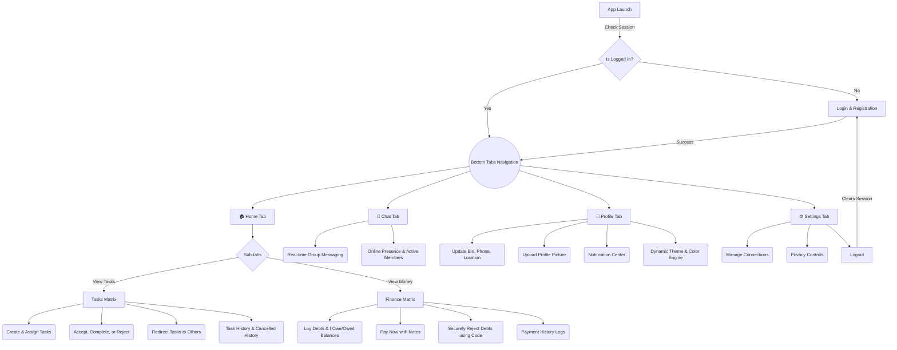

# TASKX Mobile

A comprehensive mobile application built with **React Native (Expo)** and **Supabase**, designed for seamless task management, shared expense tracking, and real-time community chat.

## 🗺️ Application Architecture & User Flow



## ✨ Core Features

1. **Dual-Tab Productivity (Home)**
   - **Task Management**: Create tasks, assign them to group members, re-assign (redirect) if necessary, and mark completion statuses. Keeps distinct records of Active, Completed, and Cancelled tasks.
   - **Expense Tracking (Money Tab)**: Easily record "I Owe" and "I'm Owed" debts. Approve and securely reject bad payments (via authorization codes) to prevent false ledgers.

2. **Real-time Engine**
   - **Group Chat**: Supabase-powered live chat stream with instant updates without manual refreshing.
   - **Active Presence**: Automatically detects which registered users are currently active within the group community.

3. **Dynamic User Customization**
   - Built-in UI Theme Engine containing Light/Dark mode functionality.
   - 6 vibrant accent colors (Violet, Blue, Emerald, Rose, Amber, Indigo) uniquely saved to the user's synced database profile.

4. **Security & Data Handling**
   - Supabase Edge Storage natively handles React Native file binaries (ArrayBuffers) to optimize securely saving profile pictures.
   - Integrated Row-Level Security (RLS) ensures users can exclusively edit tasks and transactions involving them.

---

## 🛠️ Technology Stack

* **Frontend Framework**: React Native
* **App Engine / Bundler**: Expo (with Expo Router for file-based navigation)
* **Icons**: `lucide-react-native`
* **Styling**: Vanilla React Native StyleSheet + Expo Linear Gradient
* **Backend as a Service**: Supabase (PostgreSQL Database)
* **Auth**: Supabase Authentication (Email/Password)
* **Realtime**: Supabase Postgres Changes capabilities

---

## 🚀 Getting Started

### 1. Database Setup
Locate the `schema.sql` (if provided) and run it within the Supabase SQL Editor. This file contains all necessary table definitions, triggers, handles automatic profile generation, and institutes the `profile-images` storage bucket.

### 2. Environment Setup
Fill out the variables inside `supabase.txt` and map its URL/Anon Key into `lib/supabase.ts` (this is automatically wired if previously generated).

### 3. Install Dependencies
```bash
npm install
```

### 4. Start Development Server
```bash
npx expo start
```
*   Press `a` to open in Android Emulator
*   Press `i` to open in iOS Simulator

### 5. Compile Native APK via EAS
To compile the raw Android application directly to your computer (APK format), execute:
```bash
npx eas build --platform android --profile preview
```
